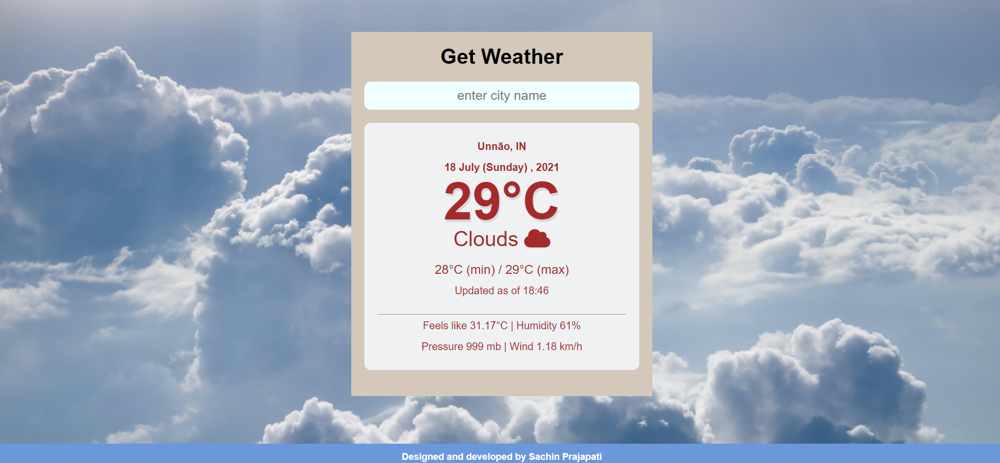

# Weather_webApp

## I used open weather API to fetch data 

### This  web project done in html,css ,js

Real-Time Weather Monitoring System
Overview
This project is a real-time data processing system that collects weather data from the OpenWeatherMap API and provides summarized insights, including daily weather summaries and alerts based on user-configurable thresholds. The system processes data for multiple Indian cities and features visualizations for enhanced weather monitoring and analysis.

Key Features
Real-Time Data Retrieval: Fetches weather data for selected Indian cities (Delhi, Mumbai, Chennai, etc.) at regular intervals.
Temperature Conversion: Converts temperature data from Kelvin to Celsius.
Daily Weather Summaries: Provides average, maximum, and minimum temperatures, along with the dominant weather condition for each day.
User-Configurable Alerts: Allows users to set thresholds for temperature and weather conditions to receive alerts if these limits are breached.
Data Visualization: Displays daily summaries, trends, and alerts using visualizations.
Technologies Used
Programming Language: [ JavaScript, etc.]
API: OpenWeatherMap API

Additional Tools: Docker (optional for containerization)
Prerequisites
[Programming Language] installed
Access to OpenWeatherMap API key (Sign up here for a free API key)
[Database technology] installed
[Any other prerequisites, e.g., Node.js, Python libraries, etc.]
 
### Features of the project.

* It provide dynamic weather data like temp, min max temp etc.
* Dynamic background images change according to weather status.
* Dynamic weather icon change according to weather status.
* It provide basic information like feels like temperature,humidity,pressure,wind speed.
* It will not accept empty input.
* it will give you  alert if city name not matched with api  data.
* a good  ux/ui 

### Snapshot

* Default 

* when you entered any valid city
 

* when you did'nt entered anything 
 

* when entered city did'nt matched with data
 

